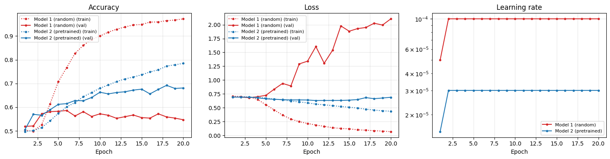
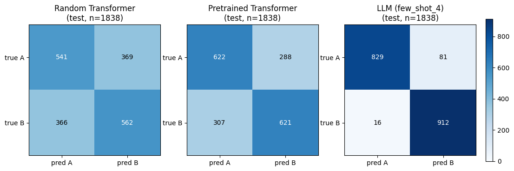

# NLP Project 2 — Transformers on PIQA

Single-notebook project comparing three transformer-based approaches on the
[PIQA](https://huggingface.co/datasets/ybisk/piqa) physical-commonsense MCQ task:

1. **Random Transformer** — `distilroberta-base` config, weights re-initialized, trained from scratch.
2. **Pretrained Transformer** — `distilroberta-base` finetuned with the same siamese MCQ head.
3. **LLM** — Claude Sonnet 4.6 via the Anthropic Messages API, prompt-engineered only (no finetuning).

Everything (preprocessing audit, training, hyperparameter sweeps, evaluation,
error analysis) lives in [NLP_Project_2_Benjamin_Amhof.ipynb](NLP_Project_2_Benjamin_Amhof.ipynb).

## Running

The notebook is self-contained. Section 2 has a *Standalone credentials* cell —
either paste `ANTHROPIC_API_KEY` / `WANDB_API_KEY` directly into it, or leave
both as `None` and put them in a `.env` file (see [.env.example](.env.example));
`python-dotenv` loads them into the env and every API call falls back to that.

If you want the trained checkpoints already in place (so the training cells
skip and no Anthropic calls are needed), pull them from
[github.com/sudoBeni/NLP_Project_2_Transformers](https://github.com/sudoBeni/NLP_Project_2_Transformers)
into `./checkpoints/`. With the bundle present the notebook runs end-to-end
without any keys — the LLM eval reads from the cached JSONL.

## Results

PIQA accuracy on the course-mandated splits (`train[:-1000]` / `train[-1000:]` / `validation`):

| Model                  | val acc | test acc |
|------------------------|--------:|---------:|
| Random baseline        |   0.500 |    0.500 |
| Random Transformer     |   0.586 |    0.600 |
| Pretrained Transformer |   0.692 |    0.676 |
| LLM (`few_shot_4`)     |   0.961 |    0.947 |

### Best-run training curves (Models 1 & 2)

Per-epoch accuracy / loss / learning-rate for the two winning full-retrain
configs (Section 5.5 of the notebook). Best hyperparameters: both runs used
`constant_with_warmup`, `wd=1e-2`, `batch_size=256`, `epochs=20`. Model 1
peaked at `val_acc=0.586` on epoch 6 (`lr=1e-4`, `dropout=0.1`) and then
overfit; Model 2 peaked at `val_acc=0.692` on epoch 18 (`lr=3e-5`,
`dropout=0.2`) — pretraining acted as implicit regularization, visible
directly in the shape of the loss curves.

### Confusion matrices on the test split

Side-by-side confusion matrices for the three final models (Section 6.2),
shared color scale so areas are directly comparable. Predicted-A rates are
all close to 50 % (Random 0.493, Pretrained 0.505, LLM 0.460), so none of
the three models show meaningful position bias — the accuracy differences
come from content understanding, not label-prior shortcuts.

For per-example predictions, cross-model error overlap, and the B-bias
asymmetry check, see Sections 6.4 and 7.4 of the notebook.
